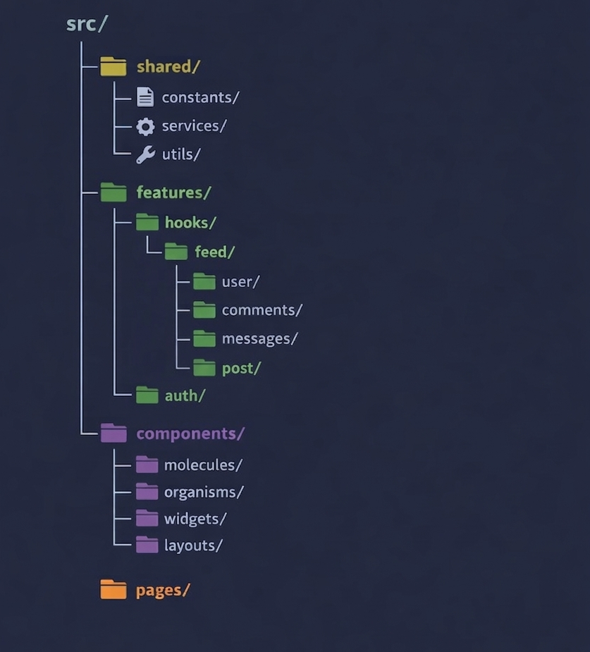

🥛 MILK – Yerel Pazar Platformu

MILK, yerel üreticiler ile tüketicileri buluşturan, gerçek zamanlı mesajlaşma ve sosyal etkileşim özelliklerine sahip bir pazar platformudur.

---

Giriş ve kayıt sistemine sahip bir randevu sistemi web uygulamasıdır.
---
Kimlik doğrulama
Kullanıcılar kayıt olabilir ve giriş yapabilirler. 

Kayıt sırasında kullanıcı bir rol seçer :
---
Alıcı-Satıcı
Kayıt olduktan sonra kullanıcılar e-posta ve şifreleriyle giriş yapabilirler.
Her kullanıcının bir profil sayfası vardır .

Profil şunları içerir:
---
Profil fotoğrafı
Ad ve soyad
E-posta adresi
Telefon numarası
Şehir
Semt

Kullanıcılar şunları yapabilir:
---
Profili güncelle
Profil bilgilerini sil
Gönderiler / Paylaşım
Kullanıcılar gönderi oluşturabilirler .

Bir gönderi şunları içerir:
---
Görüntü
Tanım
Telefon numarası
Adres

Diğer kullanıcılar şunları yapabilir:
---
Beğenilen gönderiler
Gönderilere yorum yapın

Mesajlaşma:
---
Mesajlaşma iki yönlüdür .
Kullanıcılar birbirleriyle gerçek zamanlı olarak sohbet edebilirler.

Ana Sayfa:
---
Ana sayfada Koyu Mod ve Açık Mod bulunmaktadır .
Şehir bazında arama yapılabilir .

Kullanılan Teknolojiler:
---
React – Kullanıcı arayüzü oluşturmak için
State Management – Zustand
Axios – API istekleri için 
Tailwind CSS – Kullanıcı arayüzü stillendirmesi için
React Router DOM – Sayfa yönlendirmesi için
Node.js – Arka uç ve sunucu tarafı geliştirme 

---

🥛 MILK – MVP (İLK SÜRÜM)
ZORUNLU OLANLAR

✅ Login / Register

✅ Profil bilgileri

✅ Gönderi oluşturma

✅ Ürün listeleme 

✅ Ürün detayı 

✅ Beğeni

✅ Yorum

✅ Takip / takipçi

✅ İlçe filtreleme

✅ Favori (kaydet)

Bildirim

Admin panel

💡 MVP = “Köy ürünleri”

---

🚀 V2 (ÜRÜN OLMA YOLU)

👉 “Kullanan geri geldi mi?”

EKLENENLER

💬 DM (satıcıya sor)

⭐ Favori üretici

🔔 Bildirim (yeni gönderi / takip)

🟢 Doğrulanmış satıcı

🧾 Sipariş talebi (checkout yok)

---

🌍 V3 (PLATFORM OLMA)

👉 “Bu iş büyür mü?”

EKLENENLER

🤖 Keşfet algoritması

📈 Satıcı paneli

🛡️ Gelişmiş admin panel

🌱 Organik sertifika yükleme

---

📌 Proje Yapısı (Önerilen)

---

🎯 Proje Amacı

MILK’in amacı, yerel üreticiler ile tüketiciler arasında dijital bir köprü oluşturmak ve küçük üreticileri keşfetmeyi kolaylaştırmaktır.

⸻

👩‍💻 Geliştirici

Zeynep Baş

