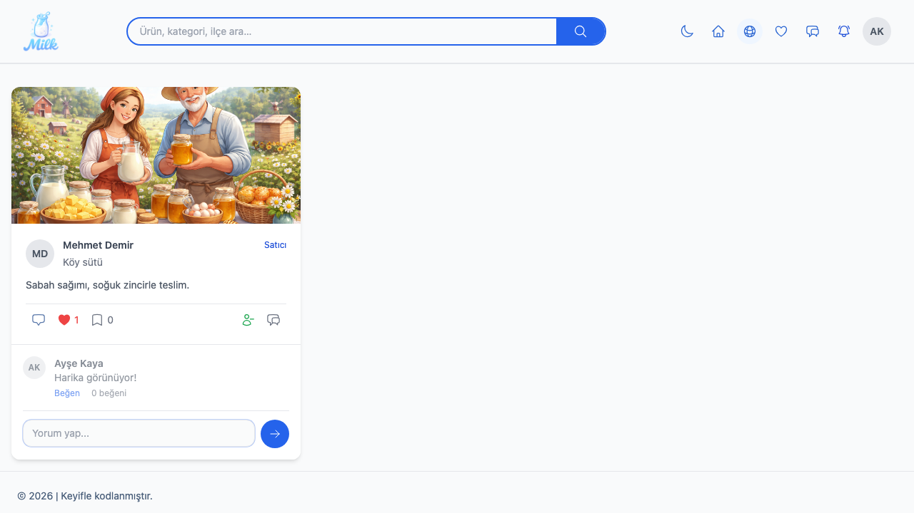
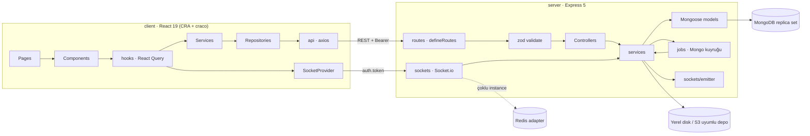
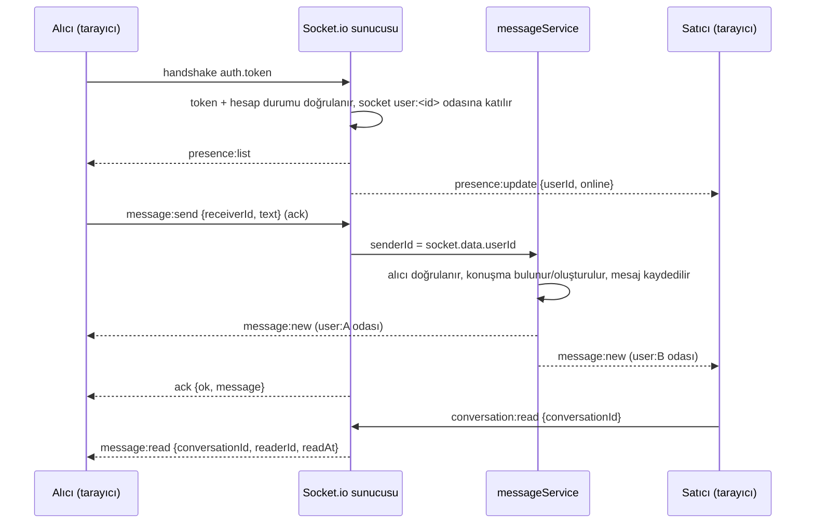
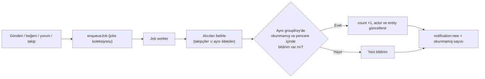
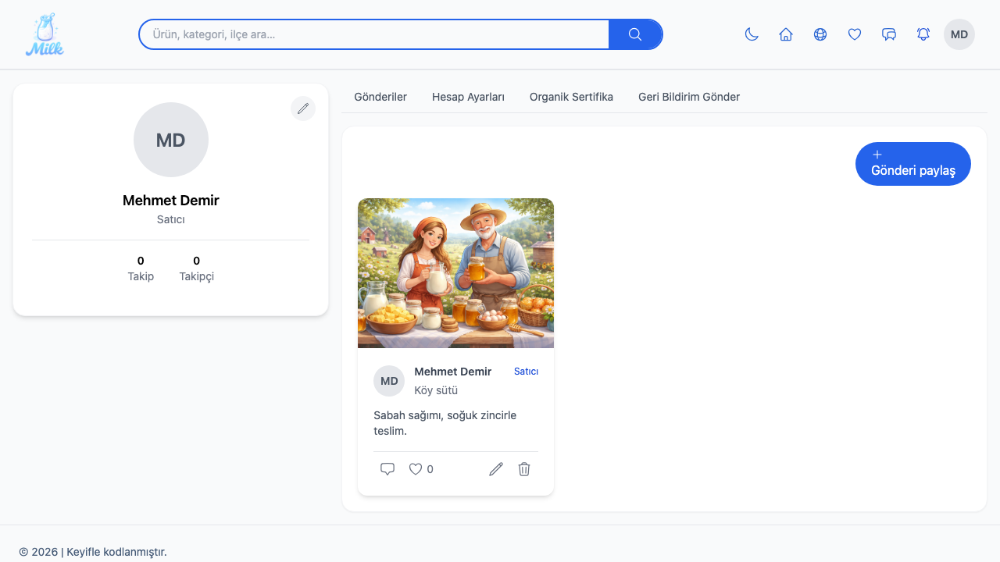
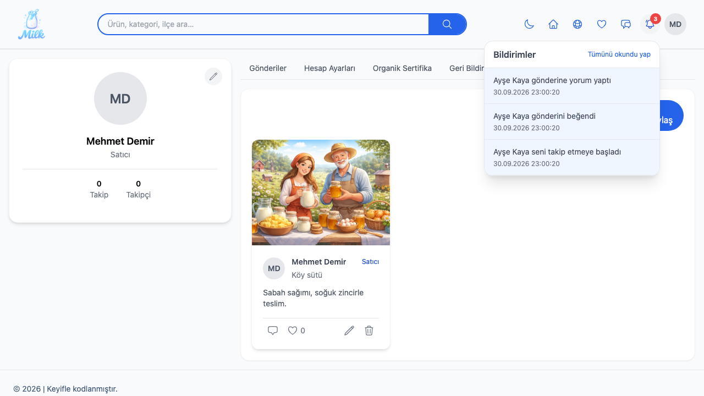
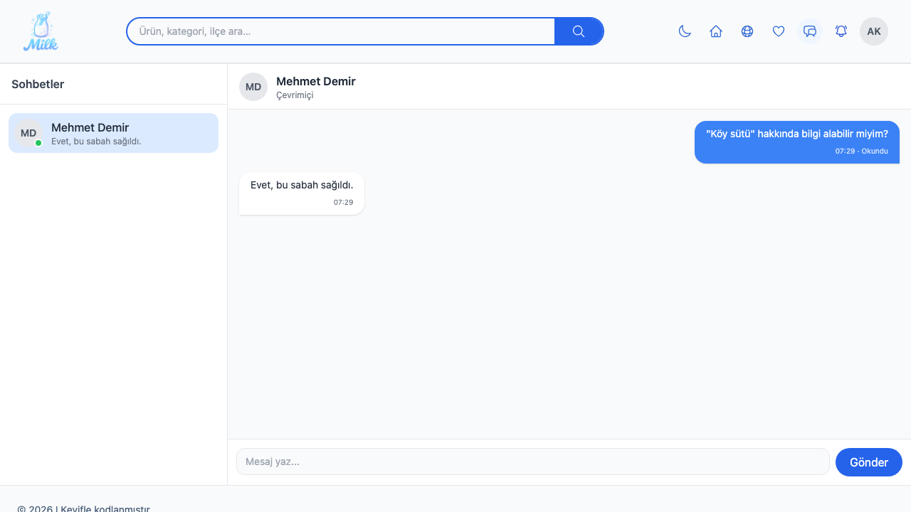

# Milk – Yerel Pazar Platformu

Milk, süt ürünleri, bal, zeytinyağı, peynir, sebze ve meyve üreten yerel üreticilerle tüketicileri doğrudan buluşturan bir pazar platformudur. Üreticiler ürünlerini paylaşır; alıcılar üreticileri takip eder, gönderileri beğenir, kaydeder, yorum yapar ve satıcıyla gerçek zamanlı mesajlaşır.



## İçindekiler

- [Problem](#problem)
- [Roller ve yetkiler](#roller-ve-yetkiler)
- [Özellikler](#özellikler)
- [Mimari](#mimari)
- [Socket olay akışı](#socket-olay-akışı)
- [Bildirim akışı](#bildirim-akışı)
- [Teknoloji seçimleri](#teknoloji-seçimleri)
- [Kurulum](#kurulum)
- [Testler](#testler)
- [API dokümantasyonu](#api-dokümantasyonu)
- [Ekran görüntüleri](#ekran-görüntüleri)
- [Proje yapısı](#proje-yapısı)

## Problem

Küçük üreticiler ürünlerini genelde aracılar üzerinden ya da dağınık sosyal medya hesaplarıyla satıyor. Alıcı tarafında ise "bu ürün gerçekten bu üreticiden mi, organik mi, kime sorabilirim?" soruları cevapsız kalıyor. Milk bu ikisini tek yerde topluyor:

- Üretici profili, gönderileri ve doğrulanmış satıcı rozeti,
- İl bazlı keşif ve takip edilen üreticilerin akışı,
- Ürün üzerinden satıcıya tek tıkla mesaj.

## Roller ve yetkiler

| Yetki                                                            | Alıcı (`alici`) | Satıcı (`satici`) | Yönetici (`admin`) |
| ---------------------------------------------------------------- | :-------------: | :---------------: | :----------------: |
| Keşfet, takip, beğeni, kaydetme, yorum                           |        ✓        |         ✓         |         ✓          |
| Mesajlaşma                                                       |        ✓        |         ✓         |         ✓          |
| Gönderi paylaşma, düzenleme, kaldırma (yalnızca kendi gönderisi) |        –        |         ✓         |         ✓          |
| Kullanıcı listesi, geri bildirimler                              |        –        |         –         |         ✓          |
| Organik satıcı onayı (`dogrulanmisSatici` rozeti)                |        –        |         –         |         ✓          |
| Rol değiştirme                                                   |        –        |         –         |         ✓          |

Kayıt sırasında yalnızca `alici` veya `satici` seçilebilir. Rol, organik onay ve hesap durumu gibi alanlar kullanıcının kendi profil güncellemesiyle değiştirilemez; bu alanları içeren istekler `400` ile reddedilir.

## Özellikler

- **Kimlik doğrulama:** 15 dakikalık access token yalnızca bellekte tutulur. Refresh token opaktır, `httpOnly` / `SameSite=Lax` cookie'de taşınır ve her kullanımda döndürülür (rotation). Eski bir token tekrar kullanılırsa token ailesinin tamamı iptal edilir (reuse detection). Şifre değişikliği, hesap dondurma ve rol değişikliği tüm oturumları kapatır.
- **Profil:** Ad, soyad ve konum güncellenebilir. E-posta ve şifre değişikliği mevcut şifreyi ister. Avatar yüklenebilir; hesap dondurulabilir veya silinebilir.
- **Gönderiler:** En fazla 5 görsel yüklenebilir. Dosya türü magic byte kontrolüyle doğrulanır; yalnızca JPEG, PNG ve WEBP kabul edilir. Düzenlemede görsel kaldırılabilir ve kaldırılan dosya depodan silinir.
- **Etkileşim:** Beğeni, kaydetme ve takip işlemleri atomik ve idempotenttir. Sayaçlar tutarlı kalır ve istemcide iyimser (optimistic) olarak güncellenir.
- **Akışlar:** Keşfet (başlık araması, kategori ve ilçe filtresi), takip edilenler, kaydedilenler ve kendi gönderilerim. Tüm listeler cursor tabanlı sayfalanır.
- **Bildirimler:**
  - Takip ettiğin ya da ilindeki satıcının yeni gönderisi, beğeni, yorum ve yeni takipçi bildirim üretir.
  - Aynı kaynaktan kısa sürede gelen olaylar tek bildirimde birleştirilir.
  - Bildirimler Socket.io ile anlık iletilir ve okunmamış sayacı tutulur.
- **Mesajlaşma:**
  - İki kişi arasında tek konuşma tutulur; mesajlar sayfalanır.
  - Okundu bilgisi, konuşma başına okunmamış sayısı ve çevrimiçi durumu gösterilir.
  - Ürün kartındaki mesaj butonu, ürün bilgisini route state ile taşır.
- **Hesap silme:** Soft delete uygulanır. Gönderiler, yorumlar, konuşmalar, takip ilişkileri ve bildirimler tek transaction içinde gizlenir veya temizlenir; yüklenen dosyalar silinir.
- **Erişilebilirlik:**
  - Modallarda odak tuzağı ve Escape ile kapatma var.
  - İkon butonlarında erişilebilir isimler, form hatalarında `aria-invalid` ve `aria-describedby` kullanılıyor.
  - Giriş ve kayıt sayfaları Lighthouse erişilebilirlik puanında 100 alıyor.

## Mimari


```mermaid
flowchart LR
  subgraph Client["client · React 19 (CRA + craco)"]
    Pages --> Components
    Components --> Hooks["hooks · React Query"]
    Hooks --> Services --> Repositories --> Api["api · axios"]
    Hooks --> SocketProvider
  end

  subgraph Server["server · Express 5"]
    Routes["routes · defineRoutes"] --> Validators["zod validate"]
    Validators --> Controllers --> ServiceLayer["services"]
    ServiceLayer --> Models["Mongoose models"]
    ServiceLayer --> Jobs["jobs · Mongo kuyruğu"]
    ServiceLayer --> Emitter["sockets/emitter"]
    SocketServer["sockets · Socket.io"] --> ServiceLayer
    Jobs --> ServiceLayer
  end

  Api -- REST + Bearer --> Routes
  SocketProvider -- "auth.token" --> SocketServer
  Models --> Mongo[("MongoDB replica set")]
  SocketServer -. "çoklu instance" .-> Redis[("Redis adapter")]
  ServiceLayer --> Storage[("Yerel disk / S3 uyumlu depo")]
```

**Server katmanları:** route tanımları (`routes/`) zod şemalarıyla doğrulama yapar ve aynı tanımdan OpenAPI dokümanı üretir. Controller'lar incedir. İş kuralları, sahiplik kontrolleri ve transaction'lar `services/` altındadır. Hatalar `AppError` ile tek formatta döner:

```json
{ "message": "…", "code": "…", "details": [], "requestId": "…" }
```

Express 5 async hataları kendisi yakaladığı için ayrıca `asyncHandler` kullanılmaz.

**Client katmanları:** her feature (`auth`, `posts`, `feed`, `messages`, `notifications`, `users`) `api → repositories → services → hooks → components → pages` sırasını izler. Katmanların görevleri:

| Katman         | Görev                                                                |
| -------------- | -------------------------------------------------------------------- |
| `api`          | HTTP çağrısı                                                         |
| `repositories` | Yanıtı açar                                                          |
| `services`     | Parametre ve form verisini hazırlar                                  |
| `hooks`        | React Query ile önbellek, iyimser güncelleme ve invalidation yönetir |

Zustand yalnızca istemci durumunu tutar: oturum durumu ve bellek içi token, tema ve arama. `shared/components` atomic design (atoms, molecules, organisms) izler ve feature'lara bağımlı olamaz; bu kural ESLint ile zorunlu tutulur.

## Socket olay akışı


```mermaid
sequenceDiagram
  participant A as Alıcı (tarayıcı)
  participant S as Socket.io sunucusu
  participant M as messageService
  participant B as Satıcı (tarayıcı)

  A->>S: handshake auth.token
  S->>S: token + hesap durumu doğrulanır, socket user:<id> odasına katılır
  S-->>A: presence:list
  S-->>B: presence:update {userId, online}
  A->>S: message:send {receiverId, text} (ack)
  S->>M: senderId = socket.data.userId
  M->>M: alıcı doğrulanır, konuşma bulunur/oluşturulur, mesaj kaydedilir
  M-->>A: message:new (user:A odası)
  M-->>B: message:new (user:B odası)
  S-->>A: ack {ok, message}
  B->>S: conversation:read {conversationId}
  S-->>A: message:read {conversationId, readerId, readAt}
```

- REST (`POST /api/messages`) ve socket (`message:send`) aynı `messageService.sendMessage` fonksiyonunu kullanır.
- Gönderen kimliği hiçbir zaman istemciden alınmaz.
- Olaylar yalnızca `user:<id>` odalarına gönderilir.
- Access token süresi dolunca sunucu bağlantıyı kapatır; istemci oturumu yenileyip yeniden bağlanır.

## Bildirim akışı


```mermaid
flowchart LR
  Action["Gönderi / beğeni / yorum / takip"] --> Enqueue["enqueueJob (jobs koleksiyonu)"]
  Enqueue --> Worker["Job worker"]
  Worker --> Recipients["Alıcıları belirle\n(takipçiler ∪ aynı ildekiler)"]
  Recipients --> Group{"Aynı groupKey'de\nokunmamış ve pencere içinde\nbildirim var mı?"}
  Group -- Evet --> Merge["count +1, actor ve entity güncellenir"]
  Group -- Hayır --> Create["Yeni bildirim"]
  Merge --> Emit["notification:new + okunmamış sayısı"]
  Create --> Emit
```

Bildirim üretimi HTTP isteğinin dışında, MongoDB'de tutulan bir iş kuyruğunda yapılır. Başarısız işler üstel geri çekilmeyle yeniden denenir.

| Tür            | Gruplama anahtarı        | Pencere |
| -------------- | ------------------------ | ------- |
| `new_post`     | `new_post:<satıcı>`      | 6 saat  |
| `post_like`    | `post_like:<gönderi>`    | 24 saat |
| `post_comment` | `post_comment:<gönderi>` | 1 saat  |
| `follow`       | `follow:<takipçi>`       | 24 saat |

## Teknoloji seçimleri

| Alan                   | Seçim                                                                      | Gerekçe                                                                                                                    |
| ---------------------- | -------------------------------------------------------------------------- | -------------------------------------------------------------------------------------------------------------------------- |
| Dil                    | JavaScript (ES Modules)                                                    | Tip güvenliği sınırlarda zod ile, davranış testlerle sağlanır ([ADR 0005](docs/adr/0005-typescript-yerine-zod-ve-test.md)) |
| API                    | Express 5 + Mongoose 9                                                     | Mevcut kod tabanı. Express 5 async hata yakalamayı kendisi yapar.                                                          |
| Doğrulama              | zod 4 (server), `zod/mini` (client)                                        | Tek kural dosyası (`validators/rules.js`) iki tarafta da kullanılır. OpenAPI bu şemalardan üretilir.                       |
| Kimlik doğrulama       | jose + opak refresh token                                                  | [ADR 0001](docs/adr/0001-token-stratejisi.md)                                                                              |
| Takip ilişkisi         | Ayrı `follows` koleksiyonu                                                 | [ADR 0002](docs/adr/0002-takip-iliskisi-ayri-koleksiyon.md)                                                                |
| Bildirim dağıtımı      | MongoDB tabanlı iş kuyruğu                                                 | [ADR 0003](docs/adr/0003-bildirim-dagitimi.md)                                                                             |
| Gerçek zamanlı         | Socket.io, `user:<id>` odaları, opsiyonel Redis adapter                    | [ADR 0004](docs/adr/0004-socket-oda-yapisi-ve-olcekleme.md)                                                                |
| Sunucu durumu (client) | TanStack Query                                                             | Önbellek, invalidation, iyimser güncelleme, infinite query                                                                 |
| Formlar                | react-hook-form + zod                                                      | Server ile aynı kurallar                                                                                                   |
| Loglama                | pino + pino-http                                                           | JSON loglar, `X-Request-Id` ile istek takibi, hassas alanlar maskelenir                                                    |
| Test                   | Vitest, Supertest, mongodb-memory-server, Testing Library, MSW, Playwright | –                                                                                                                          |

## Kurulum

Gereksinimler: Node.js 22 ve Docker (tek komutla kurulum için).

### Tek komutla (Docker)

```bash
docker compose up --build
docker compose exec server npx migrate-mongo up
docker compose exec server npm run seed
```

| Servis  | Adres                          |
| ------- | ------------------------------ |
| Client  | http://localhost:3000          |
| API     | http://localhost:5346          |
| Swagger | http://localhost:5346/api/docs |

MongoDB tek düğümlü replica set olarak, Redis de Socket.io adapter'ı için ayağa kalkar. Production imajlarını denemek için:

```bash
docker compose -f docker-compose.yml -f docker-compose.prod.yml up --build
```

Bu durumda client http://localhost:8080 adresindeki nginx'ten sunulur.

### Docker olmadan

```bash
npm install
npm install --prefix server
npm install --prefix client

cp server/.env.example server/.env
cp client/.env.example client/.env

npm --prefix server run migrate:up
npm --prefix server run seed
npm --prefix server run dev
npm --prefix client start
```

`server/.env` içindeki `JWT_SECRET` en az 32 karakter olmalıdır. MongoDB olarak `docker compose up -d mongo redis` kullanılıyorsa bağlantı adresindeki `directConnection=true` parametresi gereklidir (örnek dosyada hazır). Eksik veya hatalı bir ortam değişkeni varsa sunucu hangi alanın neden geçersiz olduğunu yazarak başlamayı reddeder. Transaction'lar replica set gerektirir; tek düğümlü Mongo'da işlemler transaction olmadan sırayla çalışır.

### Demo hesaplar

`npm run seed` üç hesap oluşturur; şifre hepsinde `Demo12345!`.

| Rol                  | E-posta            |
| -------------------- | ------------------ |
| Yönetici             | `admin@milk.demo`  |
| Satıcı (doğrulanmış) | `satici@milk.demo` |
| Alıcı                | `alici@milk.demo`  |

### Ortam değişkenleri (server)

| Değişken                                                                                             | Varsayılan              | Açıklama                                                                         |
| ---------------------------------------------------------------------------------------------------- | ----------------------- | -------------------------------------------------------------------------------- |
| `MONGO_URI`                                                                                          | –                       | MongoDB bağlantısı                                                               |
| `JWT_SECRET`                                                                                         | –                       | En az 32 karakter                                                                |
| `CLIENT_URLS`                                                                                        | `http://localhost:3000` | Virgülle ayrılmış CORS ve origin whitelist'i                                     |
| `ACCESS_TOKEN_TTL_SECONDS`                                                                           | `900`                   | Access token ömrü                                                                |
| `REFRESH_TOKEN_TTL_DAYS`                                                                             | `30`                    | Refresh token ömrü                                                               |
| `REDIS_URL`                                                                                          | –                       | Tanımlıysa Socket.io Redis adapter ve Redis tabanlı çevrimiçi listesi kullanılır |
| `STORAGE_DRIVER`                                                                                     | `local`                 | `local` veya `s3`                                                                |
| `S3_BUCKET`, `S3_REGION`, `S3_PUBLIC_URL`, `S3_ENDPOINT`, `S3_ACCESS_KEY_ID`, `S3_SECRET_ACCESS_KEY` | –                       | S3 uyumlu depolama                                                               |
| `JOBS_ENABLED`, `JOBS_POLL_INTERVAL_MS`                                                              | `true`, `1000`          | İş kuyruğu                                                                       |
| `TRUST_PROXY`                                                                                        | `false`                 | Ters proxy arkasında `true`                                                      |

Deploy adımları için: [docs/deploy.md](docs/deploy.md).

## Testler

```bash
npm test
npm --prefix server run test:coverage
npm --prefix client test
npm run test:e2e
npm run lint
npm run hygiene
```

| Komut                                   | Ne yapar                                                                                             |
| --------------------------------------- | ---------------------------------------------------------------------------------------------------- |
| `npm test`                              | Server testleri: Vitest, Supertest, bellek içi MongoDB replica set                                   |
| `npm --prefix server run test:coverage` | Service katmanında %80 kapsama eşiğiyle çalışır                                                      |
| `npm --prefix client test`              | Client testleri: Testing Library ve MSW                                                              |
| `npm run test:e2e`                      | Playwright senaryosu: satıcı kaydı → gönderi → alıcı takip, beğeni, yorum → bildirim → mesaj → yanıt |
| `npm run lint`                          | ESLint (`no-console` ve yorum satırı yasağı dahil)                                                   |
| `npm run hygiene`                       | TypeScript, `console`, yorum satırı ve istenmeyen dosya kontrolü                                     |

Server testlerinin kapsadıkları:

- auth ve refresh akışı (rotation, reuse detection, sekme yarışı),
- dondurulmuş ve silinmiş hesaplar,
- rol yükseltme denemesinin reddi,
- sahiplik kontrolleri ve validation,
- eşzamanlı beğeni ve takip tutarlılığı,
- bildirim gruplama, mesaj okundu bilgisi,
- socket yetkilendirmesi, migration'lar ve iş kuyruğu.

CI (GitHub Actions) her PR'da lint, hijyen, commit mesajı kontrolü, server ve client testleri, build, E2E ve Docker imajı build adımlarını çalıştırır. Performans ölçümleri için: [docs/metrics.md](docs/metrics.md).

## API dokümantasyonu

- Swagger arayüzü: `/api/docs`
- OpenAPI 3.1 dokümanı: `/api/docs/openapi.json`

Doküman, route tanımlarındaki zod şemalarından otomatik üretilir; elle tutulan ayrı bir şema yoktur.

## Ekran görüntüleri

Görüntüler Playwright senaryosu sırasında alınır (`docs/screenshots`).

| Profil ve gönderi paylaşımı            | Anlık bildirimler                                |
| -------------------------------------- | ------------------------------------------------ |
|  |  |

| Keşfet, beğeni ve yorum                | Mesajlaşma ve okundu bilgisi               |
| -------------------------------------- | ------------------------------------------ |
|  |  |

Canlı demo henüz yayında değil.

## Proje yapısı

```
client/src
  features/<ad>/{api, repositories, services, hooks, components, pages}
  shared/{api, components/{atoms, molecules, organisms}, config, layout, query, socket, store, validation}
server/src
  config  controllers  docs  jobs  middleware  models  routes  services  sockets  storage  utils  validators
server/migrations   server/scripts   server/tests
e2e/                docs/adr/
```

Karar kayıtları: [docs/adr](docs/adr).

## Lisans

[MIT](LICENCE)
